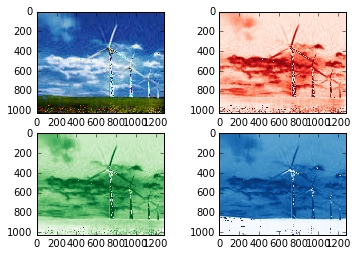

UECM3033 Assignment #2 Report
========================================================

- Prepared by: Foo Yee Sang
- Tutorial Group: T2

--------------------------------------------------------

## Task 1 --  $LU$ Factorization or SOR method

The reports, codes and supporting documents are to be uploaded to Github at: 

[https://github.com/YeeSang/UECM3033_assign2](https://github.com/YeeSang/UECM3033_assign2)

My program will check for positive definiteness of the matrix. If the matrix has all positive eigenvalues and it is symmetric, then the matrix is positive definiteness, thus the omega will have value between 0 and 2 exclusively, the iteration of SOR method will be converges, so that in this case the program will choose SOR method to solve it because SOR method require less computational cost compare to LU decomposition. If not, the matrix will solve by LU decomposition.

For LU decomposition, the matrix A will be decomposed into product of LU, that is, A = LU, where L is lower triangular matrix and U is upper triangular matrix. Hence the equation Ax = b become LUx = b, by solving Ly = b and Ux = y we can obtain the solution.
For SOR method, we calculate the diagonal matrix D,lower triangular matrix L, and upper triangular matrix U of A, where A = D - L - U. Then we calculate the spectral radius of A and use that to calculate the optimal relaxation factor, omega. Them perform iteration to obtain solution where the limit of iteration is 10 to avoid infinite iteration.

---------------------------------------------------------

## Task 2 -- SVD method and image compression

Put here your picture file (image.jpg)

How many non zero element in $\Sigma$?
The number of non zero elements in $\Sigma$ is equal to the height of the image in pixels. For this image, there are 1024 non zero elements in $\Sigma$.

Put here your lower and better resolution pictures. Explain how you generate
these pictures from `task2.py`.

Lower resolution picture(30)

Better resolution picture(200)

At first, we obtain the value of red, green, blue from the image in three matrices. Then we perform singluar value decomposition with r,g,b matrices by using np.linalg.svd() function which is defined in linalg module of numpy library. To obtain a low resolution image, we create a new matrix which is the same dimensions as $\Sigma$, but keeping the first 30 none zero elements as in $\Sigma$, and set all other none zero elements to zero. To obtain a better resolution image, repeating the same procedure as previously, but this time keep the first 200 none zero elements rather than 30.

What is a sparse matrix?
A sparse matrix is a matrix in which most of the elements are zero. For an m × n matrix, the amount of memory required to store the matrix in this format is proportional to m × n, but for a sparse matrix, substantial memory requirement reductions can be realized by storing only the non-zero entries. In this case, $\Sigma$ is a sparse matrix which all its elements are zero except the diagonal.

-----------------------------------

last modified: 11/3/2016
